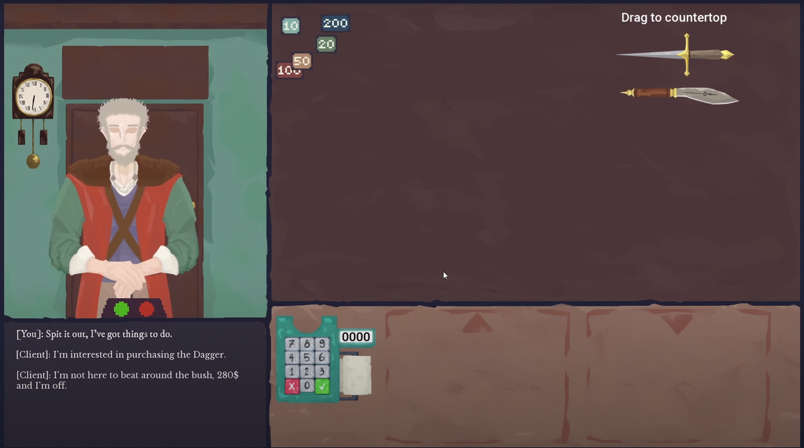
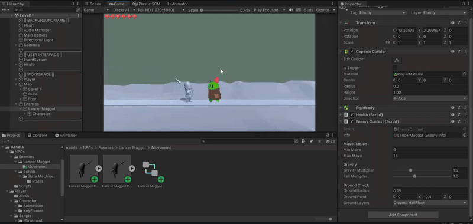
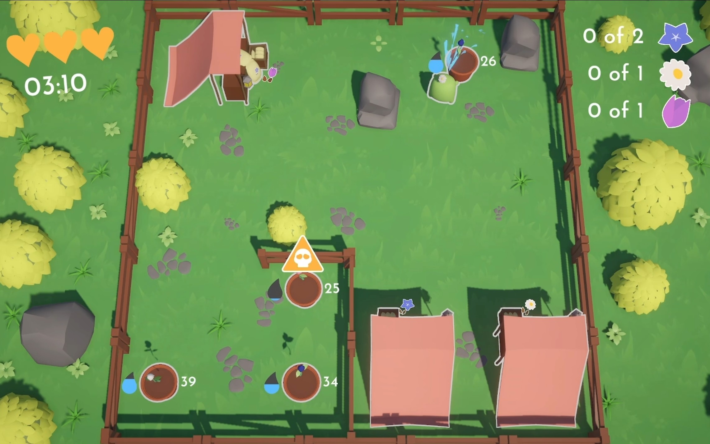
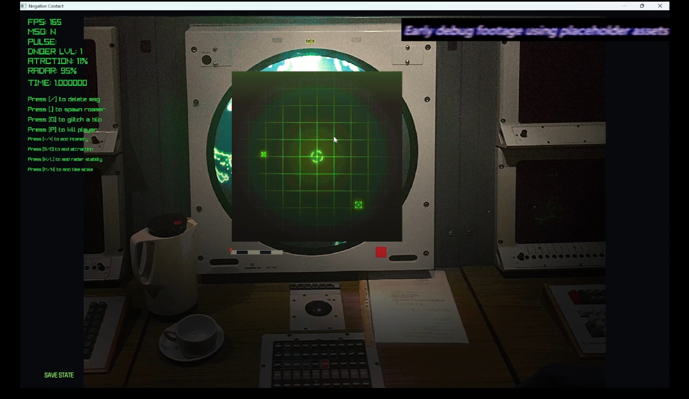

# PORTFOLIO
*Daan Osterloh*

## About Me
Welcome! My name is Daan Osterloh. I'm half Thai and half Dutch. I love to make cool stuff, whether it is code, 3D models, digital art, or even forging with hot metal. I even have a small blacksmith workshop where I tinker in as a hobby. As a programmer at heart, I aim to develop games that blend technical precision while expressing my own artistic vision. It's clear to me—and hopefully to you by the end of this—that I am passionate about game development and driven to bring worlds to life thorough my skills and creativity. 
 
 

## How I Got Here
Here's a quick run-down on my game development journey and my experience with various tools.
- 2020-2022: It all began with me trying to make games using *Roblox Studio* which taught me the basics of programming.
- 2022-2024: I transitioned to the *Unity Engine* for game development, learning *C#* and how to properly structure a real game.
- 2023: I gained brief industry experience at *Ticket Counter*, developing their QR app for Apple devices using the *Swift* programming language.
- 2024-2025: Alongside Unity I expanded to using *C++* for building games using libraries without relying on a engine. This let me experience how game engines work under the hood and gave me flexibility in designing my games.
 

## What I've Done
To show that I'm not all talk, here I will showcase my projects, the skills I've learned along the way, the challenges I've faced, and some up-and-coming stuff. Each piece should reflect my growth as a programmer, artist, and above all as a game developer. I will showcase anything worth your time, this includes unfinished projects as well.
 

### C++ trading game MVP

*Click the thumbnail to see the demo video!*
 

Created using C++ and the *SFML* library for rendering, this project was developed as an intake assignment. If you are interested in peeking under the hood, [here](https://github.com/Dandylion6/Per-The-Contract) you can find the repository of the project or [here](https://dandylion6.itch.io/per-the-contract) for a playable copy. This project took a lot of effort to get working as it is my first ever time developing a game without an engine as well as with C++, yet I managed to wrap it all up within 3 months. 

### Untitled Platformer

One the first Unity projects I developed. Wanting to make a satisfying and responsive movement system for this platformer I studied methods to achieve this. It never was more than just the movement and camera code-wise.

### Game jam 'Cozy Spring 2023'

*Click the thumbnail to see the demo video!*
 

This project was made for the 2023 'Cozy Spring' Game jam, it is the first time I participated in one. It lasted for three whole days, where me and a friend of mine developed this game from scratch. My friend was responsible for the models where I did everything else. The build can be found [here](https://dandylion6.itch.io/natures-harvest) if you are interested in trying this out.

### Current project

*Click the thumbnail to see the demo video!*
 

A little sneak peak on a side project I am working on in my free time. It uses C++ with *Raylib* and *EnTT* libraries as the backbone. EnTT is perfect for creating an ECS game structure, which is a more modern and optimised than OOP. Raylib is used for rendering and audio. Due to it being an on-going project, with release in mind, I unfortunately will not have the repository public. 

## Get to know me
**E-mail:** *daanosterloah.06@gmail.com*

**Itch.io:** *https://dandylion6.itch.io*

**Portfolio playlist:** *https://www.youtube.com/playlist?list=PL-1P7XAy1UPsn-WnpgaBeQPfrnQqMMywa*